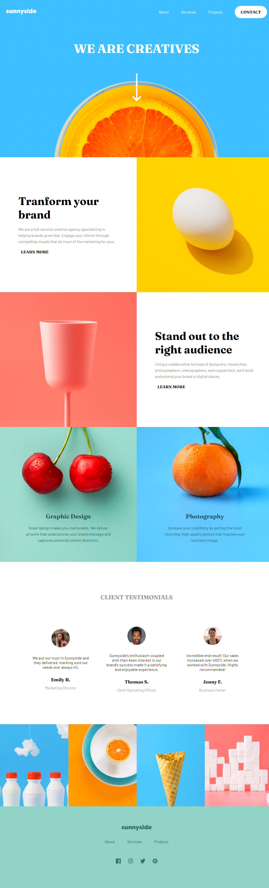
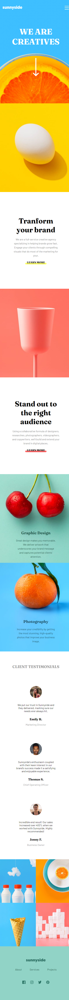
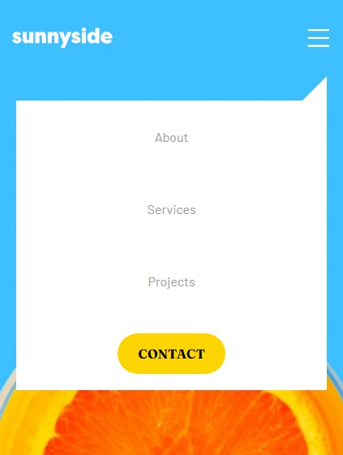

# Frontend Mentor - Sunnyside agency landing page solution

This is a solution to the [Sunnyside agency landing page challenge on Frontend Mentor](https://www.frontendmentor.io/challenges/sunnyside-agency-landing-page-7yVs3B6ef). Frontend Mentor challenges help you improve your coding skills by building realistic projects.

## Table of Contents

- [Overview](#overview)
- [The Challenge](#the-challenge)
- [Screenshot](#screenshot)
- [Links](#links)
- [My Process](#my-process)
- [Built with](#built-with)
- [What I Learned](#what-i-learned)
- [Continuous Development](#continuous-development)
- [Usepful Resources](#useful-resources)
- [Author](#author)

## Overview

### The challenge

Users should be able to:

- View the optimal layout for the site depending on their device's screen size
- See hover states for all interactive elements on the page

### Screenshot




### Links

- Solution URL: (https://github.com/1IMperaDOR0/pagina-de-destino-da-ag-ncia.github.io)
- Live website URL: (https://1imperador0.github.io/pagina-de-destino-da-ag-ncia.github.io/)

## My process

### Built with

- Markup languages ​​(HTML5 and CSS3)
- Semantic framework
- Flexbox and responsiveness
- Programming language (JavaScript)
- Interactivity
- Modular Functions

### What I learned

1. Selecting DOM Elements:
The `document.querySelectorAll()` function is used to select all elements that have the `.more` class. These elements are stored in the `moreSections` variable, which is a NodeList (a list of HTML nodes). `document.querySelector()` selects the first element that matches a specific selector within each iterated section.

In practical code context:

```javascript
let moreSections = document.querySelectorAll('.more');
```

Selects all sections with the `.more` class. Within each section, the `.learnMore`, `.zero`, and `.one` elements are selected so that interaction events can be applied to them.

2. Iterating over Elements:
The `forEach()` method iterates through each element in the `moreSections` list. This allows the code to apply custom behaviors to each selected section.

Practically:

```javascript
moreSections.forEach((section) => {
    let learnMore = section.querySelector('.learnMore');
    let underlineZero = section.querySelector('.zero');
    let underlineOne = section.querySelector('.one');
});
```

For each section, the code finds the elements `.learnMore` (link that will be interactive) and `.zero` and `.one` (elements that will have their background color changed).

3. Interaction Events:
The `mouseover` and `mouseout` events are added to the `learnMore` element to detect when the user hovers the cursor over the link and when they remove it. The `addEventListener()` method is used to listen to these events and define the desired behavior.

In practice:

```javascript
learnMore.addEventListener('mouseover', () => {
    if (underlineZero) {
        underlineZero.style.backgroundColor = 'rgb(253, 255, 105)';
    }
    if (underlineOne) {
        underlineOne.style.backgroundColor = 'rgb(255, 105, 105)';
    }
});
```

When the user hovers over the `.learnMore` link, the background color of the `.zero` and `.one` elements is changed to specific colors. Similarly, when the mouse leaves the link, the background color is reset to its original state:

```javascript
learnMore.addEventListener('mouseout', () => {
    if (underlineZero) {
        underlineZero.style.backgroundColor = '';
    }
    if (underlineOne) {
        underlineOne.style.backgroundColor = '';
    }
});
```

4. Responsive Mobile Menu:
One of the challenges in web development is to ensure that the website adapts to different screen sizes. In this code, the menu icon (`.menuIcon`) controls the visibility of the navigation menu (`nav`) on small screens.

The concept of media queries in JavaScript is applied through the `window.matchMedia()` method to check the screen size and thus control the display of the menu only when the window width is less than or equal to 655px.

Practically:

```javascript
menuIcon.addEventListener('click', () => {
    if (window.matchMedia("(max-width: 655px)").matches) {
        if (mobileMenu.style.display === 'flex') {
            mobileMenu.style.display = 'none';
        } else {
            mobileMenu.style.display = 'flex';
        }
    }
});
```

This snippet toggles between `display: flex` and `display: none` to show or hide the menu when the icon is clicked, but only on screens smaller than 655px.

5. Screen Resize Listener:
The code also listens for screen resizing using the `resize` event of the `window` object. This ensures that if the screen is resized to a size larger than 655px, the `display` style applied inline by JavaScript is removed, allowing CSS to control the display of the menu on larger screens.

Practically:

```javascript
window.addEventListener('resize', () => {
    if (window.innerWidth > 655) {
        mobileMenu.style.display = '';
    }
});
```

This prevents the menu from remaining hidden when resizing the window, ensuring proper responsive behavior.

### Continuous development

This code combines DOM manipulation, interaction events, and screen size detection to create a dynamic and responsive user experience. It demonstrates the use of click, mouseover, mouseout, and window resize events to ensure that the menu works correctly on both mobile and desktop devices, without losing the integrity of the interface when switching between different screen resolutions. With this challenge, I was able to understand how many gaps still need to be filled. In particular, I had the most difficulty developing the code following the JavaScript logic of mouseover, mouseout, and window. So, I need to develop my skills further so that they become even more refined and I can make the code cleaner and more understandable.

### Useful Resources

- [Mouseover and mouseout concepts](https://javascript.info/mousemove-mouseover-mouseout-mouseenter-mouseleave) Isso me ajudou a resolver os problemas de fazer o o underline dos learn more. Gostei muito desse padrão e vou usá-lo de agora em diante.


## Author

- Frontend Mentor - [@1IMperaDOR0](https://www.frontendmentor.io/profile/1IMperaDOR0)
- GitHub - [1IMperaDOR0](https://github.com/1IMperaDOR0)
